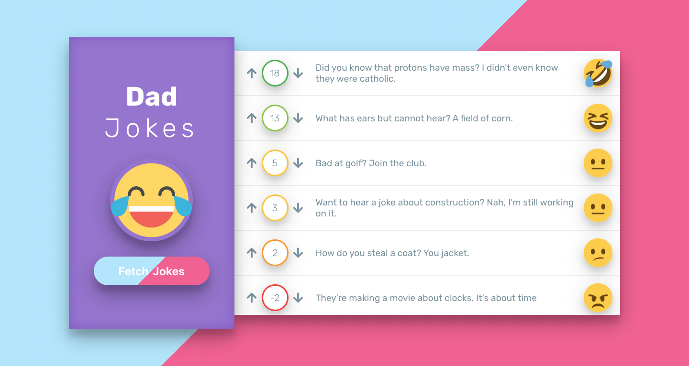

# Dad Jokes

[Dad Jokes](https://dadjokesofficial.netlify.com/) is an app that lets people view and vote on cheesy jokes. To generate jokes, I used the ICanHazDadJoke API.


## Table of content

- [Project Specifications](#Specifications)
- [Installation](#installation)
- [Contact](#contact)

## Specifications

When the page loads, it fetches 10 jokes.

The application lists the jokes, along with a “vote-up” button, a “vote-down” button, and the net score for each joke. Users can vote, and the net score should update.

### Further Study

- When jokes are loading, it displays a loading spinner or message notifying the user that the jokes are being loaded. This hides once the jokes have finished loading.
- There are no duplicate jokes shown.
- It shows the jokes sorted by net score, and update this as the scores change.
- It stores the list of jokes, with votes in local storage. When users visit the app, it shows saved jokes, rather than fetching new jokes. However, the user can still generate new jokes via the button, and these new jokes then replace the ones in local storage.
- It has CSS styling for the joke app, including FontAwesome thumbs-up/down images for the voting buttons.

## Installation

1. Clone the project to your local directory

```
git clone https://github.com/KaushikShivam/dad_jokes
```

2. The project uses NPM for managing dependencies. Run npm install to install all the required dependencies

```
npm install
```

3. Run the task runner to run the app

```
npm run start
```

## Contact

You can contact me at:

- [Portfolio](https://www.shivamkaushik.com)
- [Email](mailto:shivamkaushikofficial@gmail.com)
- [Linkedin](https://www.linkedin.com/in/kshivamdev/)
- [Twitter](https://twitter.com/kShivamDev)
- [Medium](https://medium.com/@shivamkaushikofficial)
- [Angellist](https://angel.co/kshivamdev)
